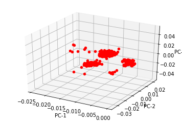

# <center> A Study on Spike Sorting techniques and Analysis</center>
---
#### <center>Author : Abishek Prasanna</center>  <center>Mail : abishek.prasanna@rutgers.edu</center>  
  <center>Data submitted : 12/21/17  </center>
  <center>Course : 530 Principles Of Artificial Intelligence   </center>
  <center>Prof. Casimir Kulikowski  </center>


### Abstract
---------------

  -  Advancement in our understanding of neural correlations and the nature of neuron computations can be studied only by analyzing the activity of multiple neurons, and their connectivity information. Spike sorting is the process of assigning neuron activities to their corresponding neurons. The noisy data that is available and its complexity necessitates the need for improved algorithms to efficiently perform spike sorting.  
  <br>
  -  This project explores answers to a few questions underlying the aspects of Artificial intelligence methods applied to the challenging problem of Spike Sorting.  
    -  With increasing complexity, meaning data of very high dimensions, how much of a down-sampling can still provide us a faithful representation of the original data?  
    -  What are the properties of the original dataset that we need to map in a lower dimension?  
    -  How does clustering result improve with different feature extraction processes?  
    -  How to estimate the number of clusters in a data distribution?  
  <br>
  -  Principal Component Analysis (PCA) and Locality Preserving Projections (LPP) for feature extraction, and K-means, GMM and Landmark Based Spectral Clustering (LSC) for clustering on a simulated spike dataset.  
  -  A better performance is observed in the application of manifold learning techniques (LPP, LSC), to the problem allowing us to understand and answer the problem of which model best fits the given problem.

### 1.  Introduction 
---
  * Recent developments in electrophysiological data reading hardware capabilities has allowed for recordings at a vastly improved rates and thus opened up possibilities to extract huge amounts of data even at very high sampling rates. Our understanding of the human brain and the central nervous system, and about how it processes information is still at a very nascent stage, and the most fundamental way to study these mechanisms involve recording neuron (nerve cell) activity and analyzing their patterns of connectivity and communication patterns. Spike Sorting is an interesting problem that aims to distinguish neuron activities, otherwise called ‘spikes’, and assigning them to their putative neurons.  
  * Manual sorting has been the traditional way of tackling this problem. Algorithmic approaches are increasingly being adapted but even the state-of-the-art approaches in this area do not scale well with an increase in the number of neurons being recorded from. Thus Spike Sorting makes for an interesting problem seeking new algorithmic approaches to handle highly complex data.  
  * In its most fundamental sense Spike sorting is a problem in signal processing, an area that has been hugely impacted by recent developments and application of methods of Artificial Intelligence.  
  * My aim in this study is to compare, contrast and evaluate the performance of the many state-of-the-art approaches to the problem of Spike Sorting, and to reflect on the principles of Artificial Intelligence that is behind the success of these methods. 
  * The transformation of data brought about, and about how the particular model approach suits the problem is what I was intent on exploring. Evaluation in all approaches is done by calculating Hits and Misses by running these methods on simulated datasets with ground truth that was fetched from a dataset made available by Quiroga et.al [1].


### 2. Background 
---
  * A simple analogy to the problem of Spike sorting would be the Cocktail Party problem. Consider a house party environment with a strong gathering of people. Spike Sorting is very similar to the problem of recording the voices of the party attendees and telling one person’s voice separate from another’s.  
  * Various factors complicate the problem of spike sorting. For example, there is a huge noise contribution to the recordings of multiple neurons due to the background activity from neurons that are far from the recording site. These multi-neuron recordings are carried out by inserting multiple electrodes that allow triangulating a single neuron’s activity. The variability of recorded spike waveform would thus be subject to the distance of the neuron from the electrode that records its activity.
  * When a neuron fires, it goes into a refractory state (about 100 ms) during which it does not spike again, thus acting as a homeostatic mechanism. All of these information are things that we can leverage in our processing of data. Similar approaches to enhance our understanding of the data has been used traditionally in problems of Artificial Intelligence and statistical pattern recognition, for example, Analysis by Synthesis Theory is an analogous approach to Speech Perception which differentiates basic patterns from a crude analysis of speech signals.
  <br>
  * Spike sorting approaches have evolved from the use of simple Amplitude discriminators to window template matching methods, and in today’s world is approached through a systematic framework. In essence, Spike sorting relies on efficient dimensionality reduction techniques and robust clustering analysis to establish patterns in spike data. 
  


#### 3. FRAMEWORK OF SPIKE SORTING
---


```python
'''
FETCH NEURON SPIKE DATA FROM MAT FILE
'''

import scipy as sp
import numpy as np
import pandas as pd
import matplotlib.pyplot as plt
import scipy.signal as signal
from scipy import io
refractory_period=1
def get_data():
    file2 = 'C:/Users/abish/Documents/Workspace/PrinciplesofAIProject/spikeSorting/Simulator/Simulator/C_Difficult2_noise005.mat'
    data1 = io.loadmat(file2)
    df_spikeclass = pd.DataFrame(np.transpose(data1['spike_class']), columns=['spike_class'])
    df_spiketimes = pd.DataFrame(np.transpose(data1['spike_times']), columns=['spike_times'])
    df_overlapdata = pd.DataFrame(np.transpose(data1['OVERLAP_DATA']), columns=['OVERLAP_DATA'])
    df_samplinginterval = pd.DataFrame(np.transpose(data1['samplingInterval']), columns=['samplingInterval'])
    df1 = pd.DataFrame(np.transpose(data1['data']), columns=['data'])
    pd.set_option('display.max_columns', None)
    
    spike_class_arr = df_spikeclass.as_matrix()
    spike_class = np.zeros((3,np.array(spike_class_arr[0,0]).shape[1]))
    spike_class[0] = np.array(spike_class_arr[0,0])
    spike_class[1] = np.array(spike_class_arr[1,0])
    spike_class[2] = np.array(spike_class_arr[2,0])
    spike_times = np.array(df_spiketimes.loc[0][0]).flatten()
    # print(spike_class.shape)
    import collections
    counter_0=collections.Counter(spike_class[0])
    counter_1=collections.Counter(spike_class[1])
    counter_2=collections.Counter(spike_class[2])
    # print( 'SC0 : {} SC1 : {} SC2 : {}'.format(counter_0,counter_1,counter_2) )
    
    sampling_interval = float(df_samplinginterval.values)
    df2 = df1.head(1000000)
    df3 = df1.loc[1000000:]
    return (df2,df3,sampling_interval,spike_class)


```

#### 3.1 FILTERING
---
The first step when processing continuously recorded data is to apply a band pass filter in order to avoid low frequency activity and visualize the spikes. I accomplish the same using a second order Butterworth Bandpass filter between 600Hz and 1000Hz. The raw input data is of the form of an array of recorded potential values


```python
def band_pass_filter(data, sampling_interval, fs, lowcut, highcut):
    # Sample rate and desired cutoff frequencies (in Hz).
    #fs = 24000.0
    #lowcut = 300.0
    #highcut = 3000.0
    
    # Butterworth second-order filter
    order = 2
    nyq = 0.5 * fs
    low = lowcut / nyq
    high = highcut / nyq
    b, a = signal.butter(order, [low, high], btype='band')
    filtered_data = signal.lfilter(b, a, data)

    T = sampling_interval
    print('Sampling Interval - {}'.format(T))
    nsamples = T * raw_data.size
    t = np.linspace(0,nsamples,num=fs,endpoint=True)
    plt.plot(t, data, label='Noisy signal')
    plt.show()
    plt.plot(t, filtered_data, label='Filtered signal')
    plt.show()
    return filtered_data
    
```


```python
# Raw data had 1.44 million data points which could not be processed at a time
raw_data,raw_data_c,sampling_interval,spike_class = get_data()

# data for first 1 million data points
data = band_pass_filter(raw_data.as_matrix(), sampling_interval, raw_data.size, 300, 500)
# data_c for remaining 440k data points
data_c = band_pass_filter(raw_data_c.as_matrix(), sampling_interval, raw_data_c.size, 300, 500)

```

    Sampling Interval - 0.041666666666666664
    


    Sampling Interval - 0.041666666666666664
    


#### 3.2 SPIKE DETECTION
---
The next step in the spike sorting framework is Spike detection from the filtered data, which is achieved using amplitude discriminators. A commonly applied metric of amplitude, in traditional signal processing applications is to set it to 3-5 times the standard deviation of noise in the data. But the assumption of Gaussian noise need not necessarily hold good at all times, and thus it has been shown that an estimate of amplitude based on median absolute deviation is more robust than one using standard deviation of the noise, and I have adopted the same values for my implementation of MAD


```python
def spike_detection(data, sampling_interval, fs, threshold = 0.5, minimalDist=75, notZero=1e-3):
    '''
    def mad(x):
        return ((np.median(np.abs(x - np.median(x))))/0.6745)
    '''
    print('Detect peaks with amplitude threshold.')
    """ 
    Performs peak detection on three steps: root mean square, peak to
    average ratios and first order logic.
    threshold used to discard peaks too small
    """
    sigma_noise = np.median(abs(data)/0.6745)
    voltage_threshold = 4.16*sigma_noise
    print('Voltage amplitude threshold - ' + str(voltage_threshold))
    
    from math import sqrt
    # compute root mean square
    root_mean_square = sqrt(np.sum(np.square(data) / len(data)))
    # compute peak to average ratios
    ratios = np.array([pow(x / root_mean_square, 2) for x in data])
    # apply first order logic
    peaks = (ratios > np.roll(ratios, 1)) & (ratios > np.roll(ratios, -1)) & (ratios > threshold)

    peak_indexes = []
    for i in range(0, len(peaks)):
        if peaks[i] and data[i]>voltage_threshold:
                peak_indexes.append(i)

    T = sampling_interval
    nsamples = T * data.size
    t = np.linspace(0,nsamples,num=fs,endpoint=True)
    
    plt.plot(t, data, label='filtered signal')
    plt.plot(t[peak_indexes], data[peak_indexes], '*', label='spike')
    plt.plot(t, [voltage_threshold]*t.size, '--',label='voltage_threshold')
    plt.legend()
    plt.show()
    return peak_indexes
```


```python
spikes = spike_detection(data,sampling_interval, data.size)
print(len(spikes))

spikes_c = spike_detection(data_c,sampling_interval, data_c.size)
print(len(spikes_c))
```

    Detect peaks with amplitude threshold.
    Voltage amplitude threshold - 9.18290883473e-08
    


    2348
    Detect peaks with amplitude threshold.
    Voltage amplitude threshold - 4.72850962417e-07
    


    1018
    

---
Spike detection is followed by separating spike information from the filtered data. The information about a neuron’s refractory period is put to use to identify data samples 1 msec before and after the spike time, to be faithfully characterized as description of a particular spike


```python
def get_spike_features(spikes, data, sampling_interval, fs, plot_type):

    fig = plt.figure()
    ax = plt.subplot(111)
    num_samples_about_spike=int(refractory_period/sampling_interval)
    spike_num_samples=2*(num_samples_about_spike)+1
    print('Each spike has '+ str(spike_num_samples) + ' samples')
    
    spike_time=np.zeros((len(spikes),spike_num_samples))
    spike_data=np.zeros((len(spikes),spike_num_samples))
    
    cnt=0
    for l in spikes:

        T = sampling_interval
        nsamples = T * data.size

        t = np.linspace(0,nsamples,num=fs,endpoint=True)
        
        spike_time[cnt]=t[l-num_samples_about_spike:l+num_samples_about_spike+1]
        spike_data[cnt]=data[l-num_samples_about_spike:l+num_samples_about_spike+1].flatten()
        
        if(plot_type=='separate'):
            plt.plot(spike_time[cnt], spike_data[cnt], label='Spike-'+str(cnt))
            plt.plot(t[l], data[l], '*', label='spike')
            plt.show()
        elif(plot_type=='together'):
            time=t[0:spike_num_samples]
            plt.plot(time, spike_data[cnt], label='Spike-'+str(cnt))
            plt.show()
        cnt+=1
    return (spike_data,spike_time)
```


```python
spike_data,spike_time = get_spike_features(spikes,data,sampling_interval, data.size, 'together')
print(spike_data.shape)
spike_df=pd.DataFrame(spike_data)
```

    Each spike has 49 samples
    


    (2348, 49)
    


```python
spike_data_c,spike_time_c = get_spike_features(spikes_c,data_c,sampling_interval, data_c.size, 'together')
print(spike_data_c.shape)
spike_df_c=pd.DataFrame(spike_data_c)
```

    Each spike has 49 samples
    


    (1018, 49)
    


```python
'''
Combine the 2 spike information
'''
print(spike_df.shape,spike_df_c.shape)
spike_df_temp=spike_df

spike_df = pd.concat([spike_df,spike_df_c])
print(spike_df.shape)
```

    (2348, 49) (1018, 49)
    (3366, 49)
    

#### 3.3 FEATURE EXTRACTION
---
  * After spike detection the filtered data is transformed to spike data which carries the information about individual spikes, which are of very high dimensions that make clustering inefficient. This demands the need for efficient feature extraction methods to map the spike data to a feature space that distinguishes spike properties. Generally, good feature space mapping can thus boost the clustering efficiency.
  * PCA finds a feature space as a linear combination of the orthogonal Principal Components, thus giving a projection with maximum variance in the data. The principal components are given by the eigenvectors of the covariance matrix of the data distribution. One of the major drawbacks in applying PCA is that it is susceptible to outliers in data. Also it restricts the data to be represented in a feature space defined by orthogonal co-ordinate axes (Principal Components). Nonetheless, PCA solves for a quick linear transformation to a feature space that is discriminative of the statistical properties in data.
  * Locality Preserving Projections are a method of manifold learning that aims to find a linear transformation of the original data by preserving locality information in the newly defined feature space. If the data were to be neatly arranged in a manifold, methods like PCA do not do well in mapping this relationship in comparison to Manifold Learning methods, because of its inability to map nonlinear relationships. LPP allows for a linear mapping that adheres with the goal of manifold learning techniques. This makes LPP robust against outliers, which can be a common problem in spike sorting techniques.


```python
def dim_redn(dataframe, method):
    
    if( method == 'PCA' ):
        from sklearn.decomposition import PCA
        pca = PCA(n_components=3, whiten=True)
        low_dim_data = pca.fit_transform(dataframe.values)

    elif( method == 'LPP' ):
        from lpproj import LocalityPreservingProjection
        lpp = LocalityPreservingProjection(n_components=3)
        low_dim_data = lpp.fit_transform(dataframe.values)
        
    print(low_dim_data.shape)
    low_dim_df=pd.DataFrame(low_dim_data)
        
    m,n = low_dim_data.shape
    idx=np.linspace(0,m-1,m)

    for i in range(n):
            plt.plot(idx, low_dim_df.loc[:,i], label='PC-' + str(i+1))
    plt.legend(loc='best')
    plt.show()
    
    
    from mpl_toolkits.mplot3d import Axes3D
    fig = plt.figure()
    ax = fig.add_subplot(111, projection='3d')
    for i in range(m):
        j=0
        while (j+1 < n):
            ax.scatter(low_dim_df.loc[i,j], low_dim_df.loc[i,j+1], c='r', marker='o')
            j+=2

    ax.set_xlabel('PC-1')
    ax.set_ylabel('PC-2')
    ax.set_zlabel('PC-3')
    plt.show()
    
    return low_dim_df
```


```python
print('PCA RESULTS')
input_df=dim_redn(spike_df,'PCA')
print('LPP RESULTS')
input_df_1=dim_redn(spike_df,'LPP')

```

    PCA RESULTS
    (3366, 3)
    


    LPP RESULTS
    (3366, 3)
    





#### 3.4 CLUSTERING
---
  * Gaussian Mixture Model is an example of an Expectation-Maximization algorithmic approach to fitting models of Gaussians onto data so as to analyze patterns and group according to the similarity measure which clusters it into separate Gaussians. K-means is a similar EM algorithm which performs admirably well when dealing with data that form circular clusters. GMM offer a powerful upgrade over K-means, by allowing to fit Gaussians on the data distribution rather than circles, and also allow for probabilistic clustering of data points. 
  * A crucial problem that we run into, when clustering using such an EM method is the lack of knowledge about the number of clusters that we should be looking for. This is a very crucial problem in the spike sorting framework, in that knowing this allows us to know how many neurons that we recorded from. State-of-the-art techniques do not estimate k well when operating on datasets from 15-20 neurons, and make estimates in the order of 7-8. One simple idea is to resort to the use of information theoretic approach, like Akaike Information Criterion or Bayesian Information Criterion to help estimate the number of clusters to be found in the data. 


```python
def gmm(df):
    max_neurons=20
    num_clusters=min(max_neurons,len(df))
    max_components = np.arange(1, num_clusters+1, 1)

    from sklearn.mixture import GaussianMixture
    models = [GaussianMixture(n, covariance_type='full', random_state=0).fit(df)
              for n in max_components]

    idx=0
    bic_val = np.zeros(num_clusters)
    aic_val = np.zeros(num_clusters)
    for m in models:
        bic_val[idx]=m.bic(df)
        aic_val[idx]=m.aic(df)
        idx+=1

    plt.figure()
    plt.plot(max_components, bic_val, label='BIC')
    plt.plot(max_components, aic_val, label='AIC')  
    plt.legend(loc='best')
    plt.xlabel('max_components');
    plt.show()
    
    b=np.argmin(bic_val)
    a=np.argmin(aic_val)
    
    X = df
    gmm = GaussianMixture(3, covariance_type='full', random_state=0)
    labels = gmm.fit(X).predict(X)
    import collections
    counter=collections.Counter(labels)
    print(counter)
    
    # define the colormap
    cmap = plt.cm.jet
    # extract all colors from the .jet map
    cmaplist = [cmap(i) for i in range(cmap.N)]
    # create the new map
    cmap = cmap.from_list('Custom cmap', cmaplist, cmap.N)
    
    fig = plt.figure()
    ax = fig.add_subplot(111, projection='3d')
    color=['r','g','b','y','c','m', 'y', 'k']
    for i in range(X.shape[0]):
        ax.scatter(X.loc[i,0], X.loc[i,1], X.loc[i,2], c=color[labels[i]], s=40, marker='o')
    ax.set_xlabel('PC-1')
    ax.set_ylabel('PC-2')
    ax.set_zlabel('PC-3')
    plt.show()
```


```python
gmm(input_df)
gmm(input_df_1)
```


    Counter({1: 2198, 2: 617, 0: 551})
    


    Counter({2: 2316, 0: 625, 1: 425})
    


```python
def kmeans(df,k):
    from sklearn.cluster import KMeans
    labels = KMeans(n_clusters=k, random_state=0).fit(df).labels_
    import collections
    counter=collections.Counter(labels)
    print(counter)

    X = df
    # define the colormap
    cmap = plt.cm.jet
    # extract all colors from the .jet map
    cmaplist = [cmap(i) for i in range(cmap.N)]
    # create the new map
    cmap = cmap.from_list('Custom cmap', cmaplist, cmap.N)
        
    fig = plt.figure()
    ax = fig.add_subplot(111, projection='3d')
    color=['r','g','b','y','c','m', 'y', 'k']
    for i in range(X.shape[0]):
        ax.scatter(X.loc[i,0], X.loc[i,1], X.loc[i,2], c=color[labels[i]], s=40, marker='o')
    ax.set_xlabel('PC-1')
    ax.set_ylabel('PC-2')
    ax.set_zlabel('PC-3')
    plt.show()
    return labels
```


```python
km_labels = kmeans(input_df,3)
km_labels_1 = kmeans(input_df_1,3)
```

    Counter({1: 2351, 2: 664, 0: 351})
    


    Counter({0: 3003, 1: 344, 2: 19})
    


---
* Landmark based spectral clustering (LSC) gives an empirical advantage over the ideas of PCA-GMM and LPP-GMM. LSC finds a feature space of a graph that does away with the constraint of being orthogonal as in the case of PCA. The feature extraction method is based on finding landmark data points from the original data (3366x49) and finding a transformation of this original data as a linear combination of these landmark data points. This is achieved through nonnegative matrix factorization techniques. I use an implementation of Nadaraya Watson Kernel regression to solve for the factorization problem, and choose landmark points by virtue of random selection from the original data points.


```python
# Function to find reciprocal of Degree matrix (D^-1)
def diag_neg( D ):
    diag_elems = np.nan_to_num( np.diagonal( D ) )
    return np.diag( np.nan_to_num( np.reciprocal( diag_elems ) ) )

# Function to find reciprocal of root of Degree matrix (D^-0.5)
def diag_neg_root( D ):
    D_root = np.sqrt( D )
    D_neg_root = diag_neg( D_root )
    return D_neg_root

# Function to find the kernel weights between 2 vectors x and u
def gaussian_kernel( x, u ):
    h = 1
    norm = np.linalg.norm(x - u)
    return np.exp(-(norm**2)/(2*(h**2)))

# Link to Landmark Based Spectral Clustering Paper : https://www.cs.cmu.edu/~xinleic/papers/aaai11.pdf
def landmark_based_SC( X, k ):
    
    p = int( np.sqrt( X.shape[0] ) )
    
    # Matrix X can be viewed as 'n' data points, each of dimension 'm'
    m,n = X.shape

    # If in Sparse COO matrix convert to array
    # X = X.toarray()
            
    # Choose p points/indices without repetition from [0,n)
    U_idx = np.random.choice( range(n), p, replace=False )

    # Fill those p randomly chosen points from matrix X into U
    U = np.zeros((m,p))
    for i in range(p):
         U[:,i] = X[:,U_idx[i]]
    print(U.shape)
    
    
    # Number of nearest landmark points from the 'p' points of U that we need to
    # consider for calculating U_r
    r = int(p/5)
    xi = np.zeros((m,1))
    Z = np.zeros((p,n))
            
    for i in range(n):
                
        # xi indicates every datapoint of matrix
        xi[:,0] = X[:,i]
                
        # U_r_idx populates xi's 'r' nearest vector's(datapoints) indices in U
        from scipy import spatial
        tree = spatial.KDTree(np.transpose(U))
        U_r_idx = (tree.query(np.transpose(xi),k=r)[1]).flatten()
        
        # Z_list stores gaussian kernel weights between xi and 'r' nearest
        # neighbours to xi in the matrix U
        # Nadraya Watson Kernel Regression
        Z_list = np.zeros(U_r_idx.size)
        ctr=0
        for j in U_r_idx:
            Z_list[ctr] = gaussian_kernel( xi, U[:,j] )
            ctr+=1
        
        # Normalize and fill weights in Z matrix
        ctr=0
        if( sum( Z_list ) ):
            for j in U_r_idx:
                Z[j,i] = Z_list[ctr]/sum(Z_list)
                ctr+=1


    assert( np.isnan(Z).any() == False )
    
    D = np.diag( np.ravel( np.sum( Z, axis=1 ) ) )
    D_neg_root = diag_neg_root( D )
    
    # Compute Z_hat = D^-0.5 * Z
    Z_hat = np.dot( D_neg_root, Z )

    # SVD of Z_hat gives B_tran
    A, S, B_tran = np.linalg.svd( Z_hat, full_matrices=False )
    B = np.transpose( B_tran )

    # What B has right now would be the eigenvectors of (Z_hat * Z_hat.T)
    
    from sklearn.cluster import KMeans
    labels = KMeans(n_clusters=k, random_state=0).fit(B[:,0:k]).labels_
    return labels
```


```python
graph = spike_df.as_matrix()
print(graph.shape)

labels = landmark_based_SC( graph.T, 3 )

import collections
counter=collections.Counter(labels)
print(counter)

for method in ['PCA','LPP']:
    if( method == 'PCA' ):
        from sklearn.decomposition import PCA
        pca = PCA(n_components=3, whiten=True)
        low_dim_data = pca.fit_transform(graph)

    elif( method == 'LPP' ):
        from lpproj import LocalityPreservingProjection
        lpp = LocalityPreservingProjection(n_components=3)
        low_dim_data = lpp.fit_transform(graph)

    X = pd.DataFrame(low_dim_data)
    print(X.shape)
    # define the colormap
    cmap = plt.cm.jet
    # extract all colors from the .jet map
    cmaplist = [cmap(i) for i in range(cmap.N)]
    # create the new map
    cmap = cmap.from_list('Custom cmap', cmaplist, cmap.N)
    
    fig = plt.figure()
    ax = fig.add_subplot(111, projection='3d')
    color=['r','g','b','y','c','m', 'y', 'k']
    for i in range(X.shape[0]):
        ax.scatter(X.loc[i,0], X.loc[i,1], X.loc[i,2], c=color[labels[i]], s=40, marker='o')
    ax.set_xlabel('PC-1')
    ax.set_ylabel('PC-2')
    ax.set_zlabel('PC-3')
    plt.show()
```

    (3366, 49)
    (49, 7)
    Counter({1: 2772, 0: 464, 2: 130})
    (3366, 3)
    


    (3366, 3)
    


### 4. Results and Discussion
---
  * A simple method of cluster evaluation is to estimate Hits and Misses in the groupings detected by the different algorithms. LSC clearly outperforms GMM and K Means in the data sample that was considered in this study. LPP being much more robust against outliers allows for better classification results in GMM in comparison to the use of PCA for feature extraction. However, when using K-means algorithm the opposite was observed to be true. GMM generally performs better when applied to spike sorting problem and this can be attributed to the soft classification assignment and the nature of model fitting being Gaussian instead of circular ones.
  * The spike data that is detected being noisy is one major reason behind the misses in clustering. Simultaneous multi-unit recordings are an extension of this scenario. Methods to tackle the same include using cubic spline interpolation to fetch original spikes and eliminate noise, use of feature extraction methods like Haar wavelet transform that allows to localize both in the time and frequency domain. 
  * GMM essentially is a Kernel Density Estimator, that learns the probability distribution of data points, and thus is a generative model, which gives us a natural way of determining number of clusters in a given dataset. Evaluating the likelihood of data, and cross-validating to avoid overfitting can help us find reasonable estimates of the number of clusters in the recording.
  * Another improvement possible would be dump the assumption of Gaussian structure to be fit to the distribution for a more general k-multivariate model fitting, which has also been shown to perform  better than GMM
  * Going beyond the quantification of sorting accuracy in terms of misses and false positives, some works have focused on how the accuracy of the sorting process affects other measures, such as spike synchrony, rate code estimates, and neuronal correlations. Identifying causal patterns can also be achieved through the use of information theoretic approaches like understanding Transfer entropy, NPTE etc.


###  5. Acknowledgments
---
  * I would like to thank Dr.Casimir Kulikowski for his valuable inputs and for the motivation he provided to all of us in aiming to take up challenging projects, and in spurring us to think along interesting research directions that need to be considered when thinking about the future of  artificial intelligence and its applications. I would also like to thank the course TA, Blerta Lindqvist for helping me fetch datasets that I used in this project.


### 6. References
---
  [1]  Data : https://www2.le.ac.uk/centres/csn/research-2/spike-sorting  
  [2]  K.H.Kim , A Fully Automated Spike Sorting Based on Projection Pursuit and Gaussian Mixture Model, International Journal of  Control, Automation, and Systems, vol. 4, no. 6, pp. 705-713, December 2006  
  [3]  T Nguyen, Spike Sorting using Locality preserving projections with Gap statistics and landmark-based Spectral clustering, Journal of Neuroscience methods, 2014   
  [4]  Q Quiroga et. al, Past Present and Future of spike sorting techniques , Brain Research bulletin, Oct ‘2015


---
Complete Project Report - Link : https://drive.google.com/open?id=1tX9dCnli1ki7LcrWI1PDQ9Gaf38LWOwh  
